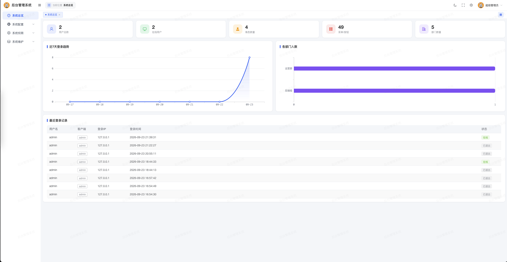
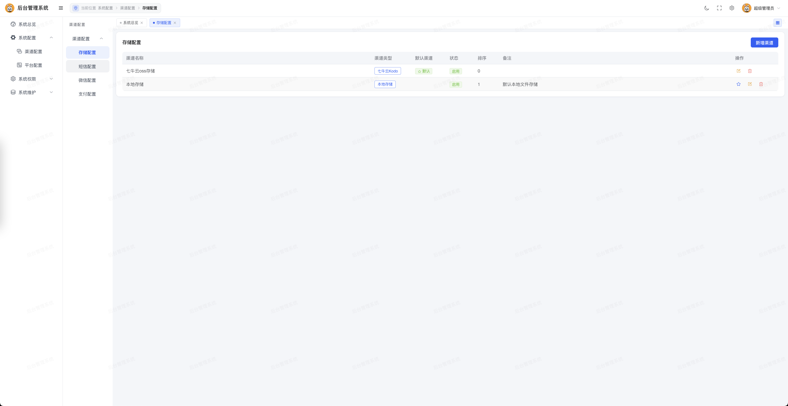
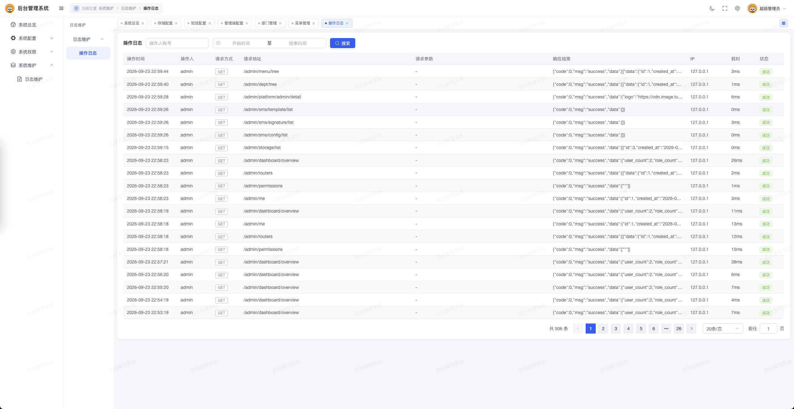
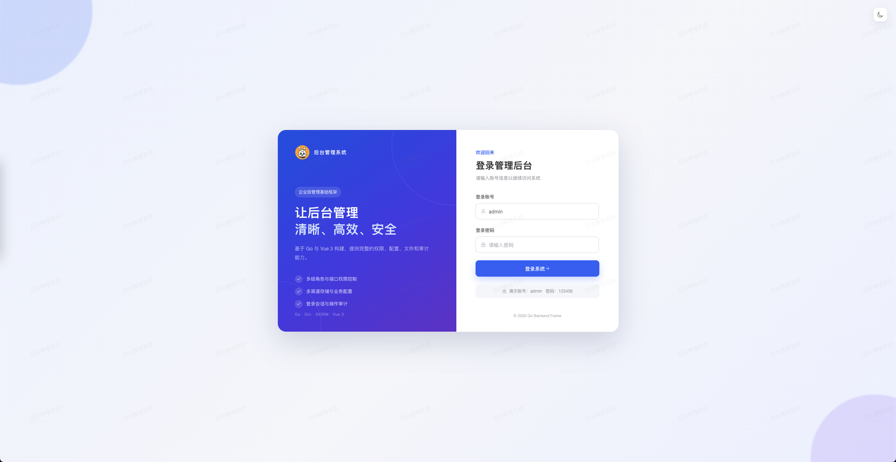

# Go Backend Frame · Admin Client

Admin frontend built with Vue 3, TypeScript, Vite and Element Plus. Menus and page routes are generated dynamically from the backend permission menus. It supports API-level button permissions, light/dark themes, tabs, operation logs, multi-channel configuration and platform branding.

> Works together with the `server_api` admin service. The project is still evolving.

| Website | Admin Client | API Server | API Docs |
| --- | --- | --- | --- |
| [Website](https://www.tutudati.com/) | [Admin source](https://gitee.com/open-source-project-open/go_basic_frame_admin) | [API source](https://gitee.com/open-source-project-open/go_basic_frame_api) | [API docs](https://s.apifox.cn/a42d392b-c5e9-4b75-8f54-e1c26339b262) |

[中文文档](README.md)

## Features

- Vue 3 Composition API + TypeScript.
- Backend-menu-driven dynamic routes and multi-level navigation.
- Page access permissions combined with API-level button permissions.
- JWT login, session expiry handling and profile management.
- Light/dark themes, fullscreen, watermark, tabs and responsive layout.
- System name and logo updated dynamically from platform configuration.
- Unified Axios wrapper with business error toasts.
- Uploads return relative paths; domains are never persisted in business data.
- All date-time values are displayed to the second, without milliseconds.
- Pure ES6+ style with arrow functions.

## Tech Stack

| Category | Technology |
| --- | --- |
| Framework | Vue 3.5 |
| Language | TypeScript 5.6 |
| Build | Vite 6 |
| UI | Element Plus |
| State | Pinia |
| Router | Vue Router |
| HTTP | Axios |
| Charts | ECharts |
| Package manager | pnpm (recommended) |

## Project Structure

```text
admin_client/
├── src/
│   ├── api/                 # Backend requests grouped by module
│   ├── components/          # Shared components
│   ├── directives/          # Permission, watermark and other directives
│   ├── enums/               # Front-end business enums
│   ├── layout/              # Header, menu, tabs and content layout
│   ├── router/              # Static and dynamic route registration
│   ├── store/               # Pinia stores
│   ├── styles/              # Global theme and UI tokens
│   ├── types/               # Request and response types
│   ├── utils/               # Auth, date, chart and other utilities
│   └── views/               # Page modules
├── .env.development        # Development environment config
├── .env.production         # Production environment config
├── .env.example            # Environment variable example
├── vite.config.ts
└── package.json
```

## Requirements

- Node.js 20+
- pnpm 9+ (use the version matching the project lockfile)
- A running `server_api service admin`

## Quick Start

### 1. Install dependencies

```bash
git clone https://gitee.com/open-source-project-open/go_basic_frame_admin.git
cd go_basic_frame_admin
pnpm install
```

An npm lockfile also exists, but please standardize on pnpm to avoid dependency drift between package managers.

### 2. Configure the backend URL

Development reads `.env.development`:

```dotenv
VITE_ADMIN_API_BASE_URL=http://127.0.0.1:8001
```

Production reads `.env.production`, which defaults to the current site origin:

```dotenv
VITE_ADMIN_API_BASE_URL=/
```

The variable can also be overridden in CI/CD. Variables must start with `VITE_`; restart the dev server or rebuild after changes.

### 3. Start the dev server

```bash
pnpm dev
```

Default URL: <http://localhost:5173>

Vite no longer proxies `/admin` or `/api`; every admin request is resolved from `VITE_ADMIN_API_BASE_URL`. For cross-origin deployments the backend must allow CORS.

### 4. Build and preview

```bash
pnpm build
pnpm preview
```

Build output goes to `dist/`.

## Login and Permissions

After a successful login the frontend loads concurrently:

- Current admin profile;
- Menu tree of the current role;
- API permissions of the current role.

The backend menu tree drives dynamic routes and the sidebar. Menu paths resolve to pages as follows:

```text
/system/user
  → src/views/system/user/index.vue
  → src/views/system/user.vue
  → 404 page
```

Button permissions use the HTTP method plus the API path:

```vue
<el-button v-perm="'POST:/admin/user/add'">Add</el-button>
```

Front-end permissions only control presentation; the real boundary is enforced by the backend `Permission` middleware.

## Request Conventions

All requests go through `src/api/http.ts`:

- `baseURL` comes from `VITE_ADMIN_API_BASE_URL`;
- `Authorization: Bearer <token>` is attached automatically;
- The backend `{ code, msg, data }` envelope is parsed centrally;
- HTTP or business code `401` clears the session and redirects to the login page;
- Concurrent error toasts are deduplicated within a short window.

Add new endpoints in `src/api/<module>.ts` and declare types in `src/types/<module>.ts`.

## Page and Component Standards

- Keep pages consistent with the existing design system; prefer the color and spacing variables in `src/styles/index.css`.
- Use shared classes such as `.page-card`, `.toolbar` and `.table-operations` for page bodies.
- Both light and dark themes must work; never hard-code colors for a white background only.
- Support common desktop widths and degrade gracefully on narrow screens.
- Model request and response fields explicitly in TypeScript; avoid `any`.
- Keep enums in `src/enums` with values matching the backend, starting at `1`.
- Format date-time values to the second via `src/utils/datetime.ts`.
- Use the shared upload component and store relative paths in business payloads.
- New page routes are driven by database menus; do not duplicate them as static business routes.

## Adding a Page

Using `/config/example`:

1. Create `src/views/config/example/index.vue`.
2. Add the corresponding module files in `src/api` and `src/types`.
3. Add the menu page, query permission and action button permissions to `sys_menu` in the backend.
4. Ensure the menu `path` is `/config/example`.
5. Assign the menu permissions to a role, then re-login or refresh permission data.

## Development Checks

```bash
# TypeScript and Vue type checking
pnpm exec vue-tsc --noEmit

# Production build
pnpm build
```

Before committing, also verify:

- The page renders correctly in both light and dark themes;
- Roles without permission do not see the button and the backend returns 403;
- Loading, empty, error and duplicate-submit states behave correctly;
- New fields match the backend request and response structures;
- No `.env.local`, build artifacts or real secrets are committed.

## Deployment

`pnpm build` produces static files deployable to Nginx, Caddy or object-storage static hosting.

Vue Router uses history mode, so the web server must fall back unknown front-end routes to `index.html`. Nginx example:

```nginx
server {
    listen 80;
    server_name admin.example.com;
    root /var/www/admin_client/dist;
    index index.html;

    location / {
        try_files $uri $uri/ /index.html;
    }
}
```

If the frontend and backend are on different origins, configure HTTPS, CORS and the correct `VITE_ADMIN_API_BASE_URL`. Never store secrets in front-end environment variables, since built variables are visible to browser users.

## Contributing

1. Fork the repository and create a feature branch.
2. Follow the existing UI, directory and ES6+ code style.
3. Complete type checking and a production build before committing.
4. Include a feature description, related endpoints and necessary screenshots in the pull request.

Report security vulnerabilities through the maintainer's private channel instead of disclosing them publicly.

## Screenshots

### Dashboard



### Storage Configuration



### Platform Configuration


### Menu Management


### User Management



### Role Management


### Operation Logs



## WeChat

Scan the QR code below to discuss usage, ideas or contributions:

<p align="left">
  
</p>

## License

Released under the [Apache License 2.0](LICENSE).
